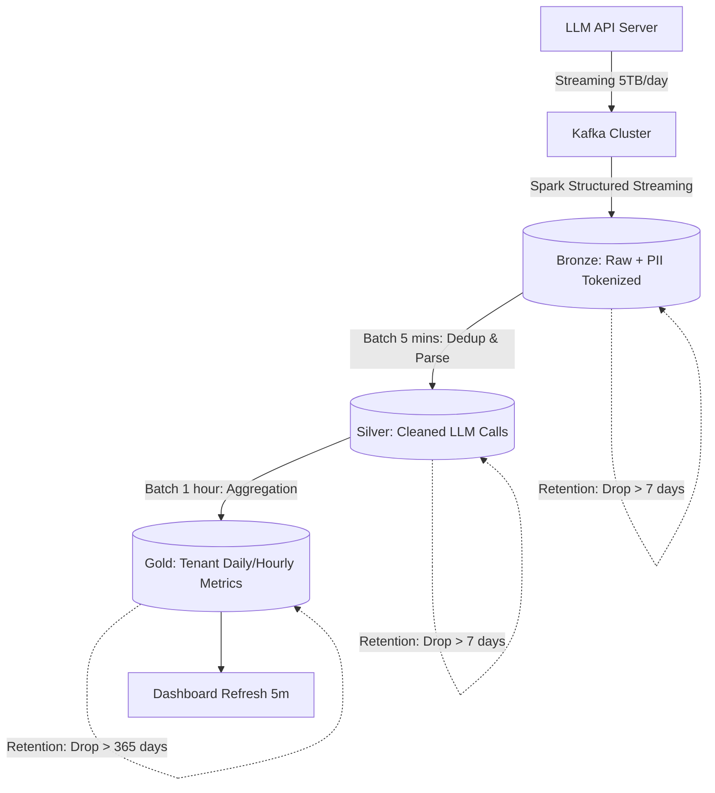

# Architecture Brief: LLM Observability at 1 Billion Requests/Day
**Student Name:** Nguyen Minh Hieu
**Student ID:** 2A202600180

## 1. Problem Statement
The system must handle 1 billion API requests daily (approx. 5TB of raw data/day) for a foundation-model API. The core challenge is balancing query latency (tenant dashboards must refresh every 5 minutes), storage costs (a strict budget of under $5,000/month), and stringent security requirements (PII redaction, keeping raw data for 7 days, and aggregates for 1 year). Without a carefully designed data lifecycle and partitioning strategy, costs would skyrocket, and dashboards would time out scanning massive datasets.

## 2. Architecture Diagram

## 3. Key Decisions & Rejected Alternatives

**Decision 1: Choosing Delta Lake as the Table Format**
*   **I chose Delta Lake** due to its excellent optimization features (Z-Order), native integration with Spark Structured Streaming, safe `OPTIMIZE` operations, and built-in Time Travel capabilities.
*   *I rejected Apache Iceberg* because, although it excels at hidden partitioning, Delta integrates more deeply into the Databricks ecosystem which is the assumed compute environment.
*   *I rejected plain Parquet* because it lacks ACID transactions and `MERGE` capabilities needed for deduplication in the Silver layer.

**Decision 2: Partitioning Strategy & Z-Order**
*   **I chose** to partition the Silver table by `date` and Z-Order by `tenant_id`. The Gold table is partitioned by `month` and Z-Ordered by `tenant_id`.
*   *I rejected partitioning by `tenant_id`* because the high cardinality of tenants would create thousands of small directories (over-partitioning), severely degrading cloud storage (S3) metadata retrieval performance.

**Decision 3: PII Redaction Strategy**
*   **I chose** to perform PII tokenization/masking directly during the ingestion into the Bronze layer using a UDF in the streaming pipeline.
*   *I rejected query-time Dynamic Data Masking* because the compute cost of scanning 5TB/day would be exorbitant, and misconfigured permissions could risk raw data leaks. Removing PII at the source guarantees absolute safety.

**Decision 4: Data Lifecycle Management**
*   **I chose** to keep the Bronze and Silver tables (which contain bulky prompt text) in S3 Standard for exactly 7 days. Afterward, an S3 Lifecycle rule will permanently delete them.
*   *I rejected tiering data to S3 Glacier* because the requirement states "only aggregates are kept for 1 year". There is no compliance need to keep raw prompts. Hard deletion ensures I stay under the $5,000/month budget.

**Decision 5: Streaming vs. Micro-Batch**
*   **I chose** streaming from Kafka to Bronze, but micro-batch processing (5-minute intervals) from Bronze to Silver/Gold.
*   *I rejected end-to-end Continuous Streaming* because keeping compute clusters running 24/7 for aggregations is too expensive. A 5-minute micro-batch satisfies the dashboard SLA while optimizing compute costs.

## 4. Failure Modes
*   **Failure 1 (Late Data / Duplicates):** A network outage causes a massive backlog of yesterday's requests to be dumped into Kafka at 3 AM.
    *   *Detection:* Kafka consumer lag metrics spike unexpectedly.
    *   *Rollback/Fix:* Thanks to the Medallion architecture, the Silver layer uses a `ROW_NUMBER()` logic combined with a Delta `MERGE`. The system will automatically upsert or discard duplicate records without polluting the Gold table. No manual intervention is needed.
*   **Failure 2 (API Schema Breakage):** The upstream LLM API introduces a new nested JSON field, breaking the Bronze-to-Silver parsing job.
    *   *Detection:* Dead-letter queue (DLQ) volume and error rates increase.
    *   *Rollback/Fix:* Delta's Schema Evolution (`schema_mode="merge"`) can be enabled. If bad data was already ingested (e.g., a numeric field changed to string), I will use Delta Time Travel (`RESTORE`) to rollback the Silver table to the version immediately preceding the incident, patch the parsing code, and re-run the pipeline.
*   **Failure 3 (Resource Exhaustion from Small Files):** The continuous 5-minute micro-batches generate too many small files, gradually slowing down dashboard queries throughout the day.
    *   *Detection:* Dashboard P95 query latency exceeds 2 seconds.
    *   *Rollback/Fix:* Set up an automated `OPTIMIZE` job triggered every 2 hours to compact small files, paired with a `VACUUM` command to clean up stale versions and reclaim storage space.

## 5. Cost Estimation
Target Budget: Under $5,000/month.
*   **Storage (S3 Standard - approx. $0.023/GB/month):**
    *   Bronze & Silver (7-day retention): 5TB/day * 2 layers * 7 days = 70TB. Cost: 70 * 1024 * 0.023 ≈ $1,648/month.
    *   Gold (1-year retention of aggregates): Assuming high compression yields 10GB/day. 10GB * 365 days = 3.6TB. Cost: 3.6 * 1024 * 0.023 ≈ $84/month.
    *   *Total Storage:* ~$1,732/month.
*   **Compute (Databricks/Spark):**
    *   Ingestion + Micro-batch: Instead of a 24/7 cluster, using Serverless Compute or Spot Instances triggered on a 5-minute schedule will keep compute costs to approximately $3,000/month.
*   *Total Estimated Cost:* ~$4,732/month (Feasible and within budget).

## 6. MVP Plan (First Slice to Build)
In the first sprint, I will exclusively build the Core Path to prove the concept:
1. Mock a Data Generator pushing 10,000 requests/second directly into the Bronze directory.
2. Write a simple Spark micro-batch script to read from Bronze, parse the JSON (ignoring PII masking for the MVP), deduplicate, and safely append to Silver.
3. Generate the Gold table summarizing Daily Cost by `tenant_id` and schedule an `OPTIMIZE ZORDER BY (tenant_id)` cronjob.
4. Write sample queries to measure latency, proving that Z-Order effectively improves `tenant_id` filtering speeds compared to scanning the raw Silver table.
